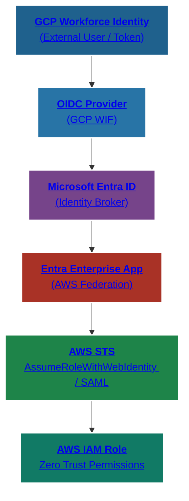

# 📘 LAB 03 — GCP → Entra → AWS Identity Chain (Multi-Cloud Trust Loop)  
**SecureTheCloud Identity Federation Academy — Volume 2**

<div align="center">
  
</div>

---

## 🔗 Multi-Cloud Identity Chain (Clickable Architecture)  
**GCP OIDC → Microsoft Entra → AWS SAML / STS → IAM Role**



---

# 🎯 Objective

In this lab, you build the **tri-cloud identity trust chain**:

✔ GCP authenticates the user  
✔ Entra acts as an identity broker  
✔ Entra issues a SAML assertion to AWS  
✔ AWS STS validates the assertion  
✔ AWS IAM Identity Center maps user → Permission Set  

This enables:

- Cross-cloud SSO  
- Zero Trust multi-cloud access  
- Single identity across all clouds  
- SIEM correlation across AWS, Entra, GCP  

This is **CSSP-level identity engineering**.

---

# 🧩 Prerequisites

- ✔ GCP Workforce Federation (Lab 01)  
- ✔ GCP → AWS OIDC trust (Lab 02)  
- ✔ Entra ↔ AWS Federation (Volume 1 — Labs 02–06)  
- ✔ Conditional Access policies configured  
- ✔ Permission Sets assigned  
- ✔ SCIM provisioning functional  

---

# #️⃣ Step 1 — Understand the Identity Flow

This lab implements the following identity chain:

1. User signs in using **GCP Workforce Identity**  
2. GCP issues an **OIDC token**  
3. Token is passed to **Microsoft Entra (broker)**  
4. Entra evaluates:  
   - Conditional Access  
   - MFA  
   - Device posture  
5. Entra issues **SAML assertion** to AWS  
6. AWS STS validates:  
   - Issuer  
   - Signature  
   - Audience  
   - Session context  
7. AWS IAM Identity Center maps user → Permission Set  
8. User lands in AWS SSO Portal with correct roles  

This is enterprise-grade **multi-cloud identity federation**.

---

# #️⃣ Step 2 — Register GCP Identity as External IdP in Entra

Azure → **Entra ID → External Identities → All Identity Providers**

Add **Custom OIDC Provider**:

| Field | Value |
|-------|--------|
| Issuer | GCP Workforce Provider `issuerUri` |
| JWKS endpoint | Auto-detected |
| Client ID (aud) | Your GCP WIF audience |
| Name | SecureTheCloud-GCP-Provider |

Enable:

### ✔ “Allow federation tokens”

---

# #️⃣ Step 3 — Configure Attribute Mapping in Entra

Entra → External Identities → **User attributes**

| GCP Claim | Entra Attribute |
|-----------|------------------|
| `assertion.email` | `userPrincipalName` |
| `assertion.email` | `mail` |
| `assertion.groups` | `extension_groups` |
| `assertion.hd` | `domain` |

This allows Entra to behave as a **broker**.

---

# #️⃣ Step 4 — Assign Users/Groups to AWS Enterprise App

Entra → **Enterprise Applications → AWS IAM Identity Center**

Assign:

- GCP-federated test user  
- GCP-federated test group  

These become AWS Identity Center users.

---

# #️⃣ Step 5 — Test GCP → Entra Authentication

Run:

```bash
gcloud auth login --update-adc
```

If GCP asserts:

- issuer  
- audience  
- email  

Entra should show:

- ✔ External OIDC login  
- ✔ Conditional Access evaluated  
- ✔ MFA succeeded  

---

# #️⃣ Step 6 — Entra Issues SAML to AWS

Once Entra verifies the identity, it sends a SAML assertion to AWS.

AWS Identity Center expects:

| SAML Field | Purpose |
|------------|---------|
| NameID | User identifier |
| Role | AWS IAM role mapping |
| RoleSessionName | Session name |
| SessionDuration | Token lifetime |

Roles are assigned based on **Permission Sets** from Volume 1.

---

# #️⃣ Step 7 — Validate Identity Path in AWS

AWS IAM Identity Center → Users / Groups

You should see:

- GCP → Entra → AWS SCIM-synced user  
- Group membership intact  

Test login at:

```
https://<your-domain>.awsapps.com/start
```

Expected:

- Correct accounts  
- Correct Permission Sets  
- Correct roles  

---

# #️⃣ Step 8 — Validate Logs Across All Clouds

### 🔹 **GCP Logs**
Check:

- `WorkforcePoolTokenIssued`  
- `STS.TokenExchange`  
- `AttributeMapping`  

### 🔹 **Entra Logs**
Check:

- External OIDC login  
- Conditional Access enforcement  
- SAML token issued  

### 🔹 **AWS CloudTrail**
Check:

- `AssumeRoleWithSAML`  
- `AssumeRoleWithWebIdentity`  
- Permission Set sessions  

This validates the **entire trust mesh**.

---

# 🧪 Lab Completion Checklist

| Validation | Status |
|------------|--------|
| GCP OIDC Provider working | ✔ |
| Entra OIDC External Provider registered | ✔ |
| Entra attribute mapping functional | ✔ |
| Entra → AWS SAML federation works | ✔ |
| SCIM group sync correct | ✔ |
| AWS STS accepted identity | ✔ |
| End-to-end login success | ✔ |
| Logs validated across all 3 clouds | ✔ |

---

## 🔗 Next Lab →
📘 <a href="./04-end-to-end-gcp-federation.md">04-end-to-end-gcp-federation.md</a>

## 🔙 Back to Lab 02 →
📘 <a href="./02-gcp-to-aws-federation.md">02-gcp-to-aws-federation.md</a>

---

<div align="center">

  

  <br><br>

  © 2025 SecureTheCloud.dev — All Rights Reserved  
  <strong>Zero Trust • Multi-Cloud • Identity • Architecture</strong>

  <br><br>

  <a href="https://securethecloud.dev/terms">Terms</a> •
  <a href="https://securethecloud.dev/privacy">Privacy</a> •
  <a href="https://securethecloud.dev/status">Status</a> •
  <a href="https://securethecloud.dev/community">Community</a> •
  <a href="https://securethecloud.dev/docs">Docs</a>

</div>
